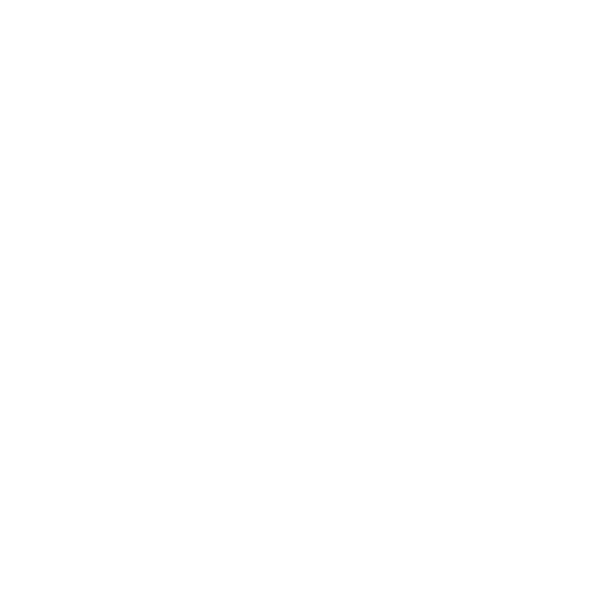

<p align="center">
  
</p>

<h1 align="center">PRISM</h1>
<p align="center"><strong>AI-Native Autonomous Materials Discovery</strong></p>
<p align="center">
  <em>MARC27 &mdash; ESA SPARK Prime Contractor | ITER Supplier</em>
</p>
<p align="center">
  <code>v2.5.0-beta</code>
</p>

<p align="center">
  <a href="#quick-start">Quick Start</a> &bull;
  <a href="#architecture">Architecture</a> &bull;
  <a href="#capabilities">Capabilities</a> &bull;
  <a href="#cli-commands">Commands</a> &bull;
  <a href="#license">License</a> &bull;
  <a href="ACKNOWLEDGMENTS.md">Acknowledgments</a>
</p>

---

PRISM is an AI-native platform for autonomous materials discovery. It combines
large language models, multi-step agent orchestration, CALPHAD thermodynamics,
ML property prediction, and federated data access into a single CLI that
researchers can use to go from a hypothesis to a validated alloy candidate.

Built for the [OSIP](https://ideas.esa.int/servlet/hype/IMT?documentTableId=45087607031874021&userAction=Browse&templateName=&documentId=17c4b07a1c3b309ca9d56ea19d8e8fc0) programme, PRISM targets refractory high-entropy alloys (RHEAs)
for space propulsion but is domain-agnostic by design.

## Architecture

PRISM implements a four-module closed-loop architecture inspired by biological
evolution:

| Module | Role | Current Implementation |
|---|---|---|
| **Evolver (ACE)** | Propose candidate compositions | Agent + GFlowNet (Phase G) |
| **Mutator Fleet** | Perturb and explore the design space | Skills + tool chaining |
| **Evaluator** | Three-tier validation (surrogate / CALPHAD / experiment) | ML predict + CALPHAD bridge + validation rules |
| **MKG** | Materials Knowledge Graph for memory and retrieval | Session memory + DataStore + scratchpad |

The agent runs a **Think-Act-Observe-Repeat (TAOR)** loop with provider-agnostic
LLM backends (Anthropic, OpenAI, Google, Zhipu AI, OpenRouter), a tool registry
with 33 built-in tools + 19 optional, and 10 multi-step skills.

## Capabilities

### Data Access
- **40+ databases** via OPTIMADE federation (Materials Project, OQMD, COD, JARVIS, AFLOW...)
- **Materials Project** native API with formation energy, band gap, hull distance
- **OMAT24** and **AFLOW** available as platform-hosted databases via the provider catalog
- **Literature** search (arXiv + Semantic Scholar)
- **Patent** search (Lens.org)
- **Local data import** (CSV, JSON, Parquet)

### AI & ML
- **Property prediction** with auto-training (Random Forest, XGBoost, LightGBM)
- **Feature importance** and correlation analysis
- **CALPHAD** phase diagrams, equilibrium, and Gibbs energy (pycalphad)
- **Simulation planning** with auto-routing (CALPHAD vs DFT vs MD)

### Agent Orchestration
- **10 skills**: acquire, predict, visualize, report, select, discover, simulate, analyze phases, validate, review
- **Plan-then-execute**: agent proposes a plan, user approves before execution
- **Tool consent**: expensive operations require explicit approval
- **Scratchpad**: append-only execution log for reproducibility
- **Feedback loops**: validation and CALPHAD findings feed back into agent context

### Terminal Experience
- **Live streaming**: LLM tokens appear as they arrive (Rich Live)
- **Typed card renderers**: 11 card types with color-coded borders (input, output, tool, error, metrics, calphad, validation, results, plot, approval, plan)
- **Smart truncation**: 6-line display truncation + 50K character threshold with disk persistence
- **Cost tracking**: per-turn and cumulative session cost display
- **Crystal mascot**: hex-glyph welcome banner with capability detection

### Infrastructure
- **Two modes**: interactive REPL (`prism`) and autonomous (`prism run "goal"`)
- **Unified rendering**: both modes use the same card system and spinner
- **LLM providers**: Anthropic, OpenAI, Google, Zhipu AI, MARC27 managed
- **MCP server**: `prism serve` exposes tools and resources via FastMCP 3.x
- **Plugin system**: 7 types (Tool, Skill, Provider, Agent, Algorithm, Collector, Bundle)
- **PRISM Labs**: marketplace for premium services (Cloud DFT, Quantum Computing, Autonomous Labs, Synchrotron, HTS, DfM)
- **Unified settings**: two-tier `settings.json` (global + project) with env var overrides
- **Session memory**: save, load, and resume conversations
- **Reports**: Markdown, HTML, and PDF with embedded charts

## Quick Start

### One-command install

```bash
curl -fsSL https://prism.marc27.com/install.sh | bash
```

### pip install (from GitHub)

```bash
pip install "prism-platform[all] @ git+https://github.com/Darth-Hidious/PRISM.git"
```

### From source

```bash
git clone https://github.com/Darth-Hidious/PRISM.git
cd PRISM
python3 -m venv .venv && source .venv/bin/activate
pip install -e ".[all,dev]"
```

### Configure

```bash
prism                      # First run triggers onboarding wizard
# or manually:
prism setup                # Workflow preferences wizard
prism configure --show     # View current settings
```

### Run

```bash
# Interactive REPL
prism

# Autonomous mode
prism run "Find W-Rh alloys that are thermodynamically stable"

# MCP server for Claude Desktop
prism serve
```

See [docs/INSTALL.md](docs/INSTALL.md) for full installation details including optional extras (`[ml]`, `[simulation]`, `[calphad]`, `[data]`, `[reports]`, `[all]`).

## CLI Commands

| Command | Description |
|---|---|
| `prism` | Interactive agent REPL |
| `prism run "goal"` | Autonomous agent mode |
| `prism run "goal" --confirm` | Autonomous with tool consent |
| `prism run "goal" --dangerously-accept-all` | Auto-approve all tool calls |
| `prism serve` | Start as MCP server (FastMCP 3.x) |
| `prism search --elements Fe,Ni` | Structured OPTIMADE search |
| `prism data import file.csv` | Import local dataset |
| `prism predict --target band_gap` | Train and predict material properties |
| `prism model calphad status` | CALPHAD installation status |
| `prism sim status` | Simulation engine status |
| `prism labs browse` | Browse PRISM Labs marketplace |
| `prism setup` | Workflow preferences wizard |
| `prism configure --show` | View unified settings |
| `prism update` | Check for updates |
| `prism plugin list` | List installed plugins |

### REPL Commands

| Command | Description |
|---|---|
| `/help` | Show available commands |
| `/tools` | List available tools (33 built-in + optional) |
| `/skills [name]` | List skills or show details |
| `/plan <goal>` | Suggest skills for a goal |
| `/scratchpad` | Show execution log |
| `/status` | Platform capabilities |
| `/approve-all` | Auto-approve all tool calls |
| `/login` | Connect MARC27 account |
| `/save` | Save current session |
| `/load ID` | Load a saved session |
| `/export [file]` | Export last results to CSV |
| `/sessions` | List saved sessions |
| `/clear` | Clear conversation history |

## Project Structure

```
app/
  cli/            # MIT License — CLI entry point, TUI cards, streaming, status
    tui/          # Rich-based terminal UI (cards, spinner, welcome, streaming)
    slash/        # REPL slash-command registry and handlers
  config/         # MIT License — Unified settings, branding, preferences
  db/             # MIT License — SQLAlchemy models and database
  data/           # MIT License — DataStore and collectors
  tools/          # MIT License — Tool definitions and registry (33 built-in)
  search/         # MIT License — Federated search with providers and cache
  agent/          # MARC27 License — Agent core, TAOR loop, backends, memory
  skills/         # MARC27 License — 10 multi-step workflow skills
  ml/             # MARC27 License — ML pipelines and algorithm registry
  simulation/     # MARC27 License — Pyiron bridge + CALPHAD bridge
  validation/     # MARC27 License — Rule-based validation engine
  plugins/        # MARC27 License — Plugin framework, catalog, bootstrap
  commands/       # CLI command implementations (run, search, data, predict, etc.)
tests/            # MIT License — 870+ tests
docs/             # MIT License — Documentation and assets
```

## Testing

```bash
python3 -m pytest tests/ -v
```

870+ tests covering agent core, tools, skills, data collectors, ML pipelines,
CALPHAD integration, validation rules, plugins, CLI commands, card renderers,
streaming, and cost tracking.

## Roadmap

### Current (v2.5.0-beta)
- All 16 CLI commands built and documented
- Live text streaming with Rich Live
- Typed card renderers (11 types) for tool results
- Character-based truncation (50K threshold) with disk persistence
- Per-turn and cumulative session cost display
- Unified rendering across REPL and `prism run`
- Two-tier settings system (`settings.json` global + project)
- LLM provider abstraction (Anthropic, OpenAI, Google, Zhipu AI, MARC27)
- Federated search with 3-layer provider registry (OPTIMADE + overrides + catalog)
- PRISM Labs premium marketplace
- Tool consent, scratchpad, plan-then-execute, feedback loops
- Polished `install.sh` with unicode step markers

### Next (Phase G — deferred to ESA/seed funding)
- GFlowNet generative sampler (Evolver module)
- GNN surrogate models
- Active learning loops
- Multi-agent coordination
- Playbook system

### Buildable Now (no new dependencies)
- Interactive ML property selection UI
- AflowProvider (native API)
- Multi-objective Pareto optimization
- Domain validation rules expansion
- Automated figure captioning
- PRISM Labs marketplace API backend

### Future (Phase H — deferred)
- A-Lab robotic integration
- Federated compute
- Automated experimental validation
- MARC27 SDK (`marc27-sdk` package)

## License

PRISM uses a **dual license**:

| Component | License |
|---|---|
| CLI, config, data layer, tools, search, tests, docs | [MIT](LICENSE-MIT) |
| Agent core, skills, ML, simulation, validation, plugins | [MARC27 Source-Available](LICENSE-MARC27) |

See [LICENSE](LICENSE) for details. Commercial licensing: team@marc27.com

## Links

- [docs/INSTALL.md](docs/INSTALL.md) — Installation guide
- [SECURITY.md](SECURITY.md) — Security policy
- [CHANGELOG.md](CHANGELOG.md) — Version history
- [docs/PRISM-CLI-Description.md](docs/PRISM-CLI-Description.md) — Full CLI reference

---

<p align="center">
  
</p>
