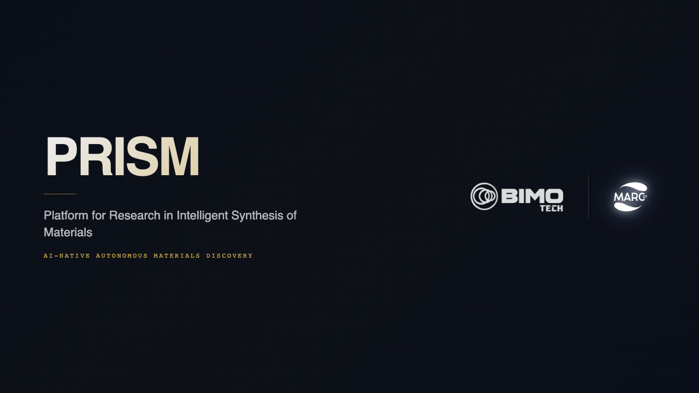

<p align="center">
  
</p>

<h1 align="center">PRISM</h1>
<p align="center"><strong>AI-Native Autonomous Materials Discovery Platform</strong></p>
<p align="center"><em>by MARC27</em></p>

---

PRISM is one command. It turns raw materials data into a searchable knowledge
graph, runs compute jobs on any backend, and connects nodes into a federated
mesh. Everything happens locally &mdash; your data never leaves your machine
unless you tell it to.

```
prism
```

Run it bare to launch the interactive agent (Ink TUI).  
Run it with a subcommand for everything else.

## Install

```bash
curl -fsSL https://prism.marc27.com/install.sh | bash
```

Or from source:

```bash
git clone https://github.com/Darth-Hidious/PRISM.git
cd PRISM && cargo build --release
cp target/release/prism ~/.local/bin/
```

## Commands

### First run

```
prism setup                          # First-time setup + platform login
prism login                          # Authenticate with MARC27 platform
prism configure --show               # Show current config
prism configure --url http://localhost:8080 --model gemma-4-E4B-it
prism status                         # Runtime paths, endpoints, auth status
```

### Node lifecycle

```
prism node up                        # Start Neo4j + Qdrant containers, register with platform
prism node up --external-neo4j bolt://db:7687   # Use existing infrastructure
prism node down                      # Graceful shutdown
prism node status                    # Health check all services
prism node logs neo4j                # Stream container logs
prism node probe                     # Probe local machine capabilities
```

### Ingest data

```
prism ingest ./alloys.csv            # CSV/Parquet -> schema -> LLM -> Neo4j + Qdrant
prism ingest ./papers/ --watch       # Watch directory for new files
prism ingest ./data.csv --corpus steel-alloys   # Tag with corpus name
prism ingest --status                # Show ingest job status
prism ingest ./data.csv --schema-only           # Schema detection only, skip LLM
prism ingest ./map.csv --mapping ontology.yaml  # Custom entity/relationship rules
```

### Query the knowledge graph

```
prism query "refractory alloys with hardness above 500 HV"
prism query --cypher "MATCH (a:Alloy)-[:CONTAINS]->(e:Element) RETURN a.name, e.name"
prism query --semantic "similar to Ti-6Al-4V"
prism query --federated "high entropy alloys"   # Queries all mesh peers
prism query --platform "nickel superalloys"     # Query MARC27 cloud graph
prism query "..." --json                        # Machine-readable output
```

### Mesh networking

```
prism mesh discover                  # Find LAN nodes via mDNS
prism mesh publish my-dataset        # Publish dataset to mesh
prism mesh subscribe alloy-db --publisher <node-id>
prism mesh subscriptions             # Show active subscriptions
```

### Compute

```
prism run python:3.11 --input data=x.csv             # Local Docker job
prism run marc27/calphad:latest --backend marc27      # MARC27 cloud
prism run my-image --ssh user@host                    # BYOC via SSH
prism run my-image --k8s-context prod                 # BYOC via Kubernetes
prism run my-image --slurm head@cluster               # BYOC via SLURM
prism job-status <uuid>                               # Check job status
```

### Workflows

```
prism workflow list                  # List available YAML workflows
prism workflow info <name>           # Show workflow details
prism workflow run <name> [args]     # Execute a workflow
prism forge --paper arxiv:2106.09685 --dataset materials-project --target runpod:A100
```

### Research

```
prism research "novel refractory high-entropy alloys" --depth 2
```

### Models

```
prism models list                    # List hosted LLM models for active project
prism models info <model-id>         # Show model details
```

### Discourse (multi-agent)

```
prism discourse create --spec spec.yaml           # Create a discourse
prism discourse list                               # List discourses
prism discourse status <id>                        # Check discourse status
prism discourse events <id>                        # Stream discourse events
```

### Deploy

```
prism deploy create --name my-service --image img:latest
prism deploy list
prism deploy status <id>
prism deploy health <id>
```

### Marketplace

```
prism marketplace search "calphad"   # Search tools and workflows
prism marketplace install <id>       # Install to ~/.prism/tools/ or ~/.prism/workflows/
```

### Publish

```
prism publish ./model-checkpoint --to marc27 --repo my-org/my-model
prism publish ./dataset/ --to huggingface --repo username/dataset --private
```

### Other

```
prism tools                          # List all available Python tools
prism agent                          # Print agent-friendly command catalog
prism report "bug description"       # File a bug report with system context
prism serve                          # Start as MCP server
```

## Architecture

PRISM compiles to a single Rust binary backed by a Python tool layer:

```
prism (Rust binary)
  |-- prism-cli          Command routing, auth, config
  |-- prism-agent        TAOR agent loop, sessions, OPA policy, streaming
  |-- prism-node         Daemon, probe, executor, E2EE key exchange
  |-- prism-ingest       LLM ontology extraction -> Neo4j + Qdrant
  |-- prism-server       Axum REST API + WebSocket + dashboard
  |-- prism-mesh         mDNS + Kafka pub/sub + federation
  |-- prism-compute      Docker / MARC27 / SSH / K8s / SLURM jobs
  |-- prism-policy       OPA/Rego policy engine
  |-- prism-workflows    YAML workflow engine
  |-- prism-core         RBAC, audit, sessions, config
  |-- prism-client       MARC27 platform API client + device-flow auth
  |-- prism-runtime      Credential storage, paths, endpoints
  |-- prism-proto        Wire types (node capabilities, mesh messages)

Python tools (49 tools, JSON stdio)
  |-- Search: OPTIMADE (20+ providers), arXiv, Semantic Scholar, web
  |-- Predict: property prediction, structure prediction, ML models
  |-- Simulate: CALPHAD thermodynamics, phase diagrams
  |-- Visualize: scatter, histogram, correlation matrix
  |-- Execute: sandboxed Python, Spark ETL
  |-- MARC27: knowledge graph, compute, marketplace
  |-- Custom: drop any .py in ~/.prism/tools/
```

Managed services (Docker containers spun up by `prism node up`):

- **Neo4j** &mdash; knowledge graph
- **Qdrant** &mdash; vector embeddings
- **Kafka** &mdash; mesh data sync (optional)

## Configuration

All config lives in `~/.prism/prism.toml`:

```toml
[node]
name = "lab-alpha"
port = 7327

[llm]
provider = "llamacpp"          # llamacpp | ollama | openai | marc27 | anthropic
url = "http://localhost:8080"
model = "gemma-4-E4B-it"
embedding_model = "nomic-embed-text"
api_key_env = "LLM_API_KEY"

[services]
mode = "managed"               # managed (Docker) or external
neo4j_uri = "bolt://localhost:7687"

[mesh]
discovery = ["mdns", "platform"]
```

CLI flags always override config values. Use `prism configure` to set defaults.

## Security

- **OPA/Rego policy engine** &mdash; every tool call checked against role-based rules
- **E2EE** &mdash; X25519 key agreement + ChaCha20-Poly1305 for node-to-node data
- **RBAC** &mdash; 4-tier roles (admin, operator, agent, viewer)
- **Audit logging** &mdash; every action logged to SQLite
- **Rate limiting** &mdash; per-endpoint (sessions: 10/s, API: 100/s)

## Testing

```bash
cargo test --workspace           # Rust tests
cargo clippy --workspace -- -D warnings
```

## License

| Component | License |
|-----------|---------|
| Python tools, tool server, config, plugins | [MIT](LICENSE-MIT) |
| Rust crates, frontend, agent, workflows | [MARC27 Source-Available](LICENSE-MARC27) |

Commercial licensing: team@marc27.com

---

<p align="center">
  
</p>
