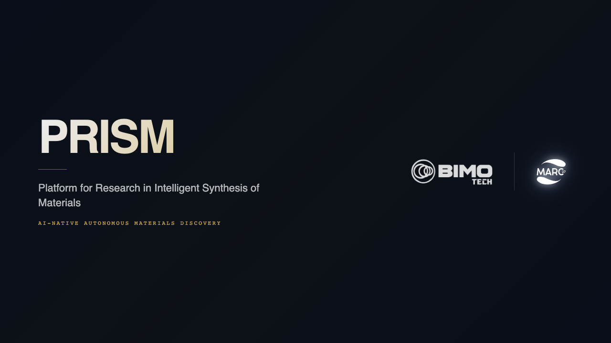

<p align="center">
  
</p>

<h1 align="center">PRISM</h1>
<p align="center"><strong>AI-Native Autonomous Materials Discovery Platform</strong></p>

---

PRISM is a single binary that gives you an AI agent for materials science. It searches knowledge graphs, runs compute jobs, orchestrates workflows, and connects to a federated mesh of research nodes.

```bash
prism                    # Launch interactive chat
prism query --platform "nickel superalloys"
prism research "high-entropy alloys" --depth 1
prism billing            # Check credit balance
```

## Install

**macOS / Linux**

```bash
curl -fsSL https://prism.marc27.com/install.sh | bash
```

**Windows** (PowerShell — not Command Prompt)

```powershell
irm https://prism.marc27.com/install.ps1 | iex
```

The installer runs in two stages: it puts the binary on your `PATH`, then
triggers `prism doctor`, which provisions the Python tool platform and prints
what is and isn't ready. Re-running it resumes rather than starting over.

### Requirements

| | |
|---|---|
| **Python 3.11 or newer** | Required, not optional. The agent runs its tools in a Python worker; without 3.11+ `prism` exits immediately with `No Python 3.11+ found`. macOS's built-in `python3` is 3.9 — `brew install python@3.12`. |
| **Linux: glibc 2.35+** | Ubuntu 22.04+, Debian 12+, SLES 15 SP6+. RHEL/Rocky 9 ship glibc 2.34 and are **not** supported by the prebuilt binaries — build from source there. |
| **Disk** | ~250 MB for the binary and ~400 MB for the Python environment. |

### Supported platforms

| Platform | Archive | Status |
|----------|---------|--------|
| macOS Apple Silicon | `prism-macos-aarch64.tar.gz` | Supported, macOS 11+ |
| macOS Intel | `prism-macos-x86_64.tar.gz` | Supported; no local embedding model — see below |
| Linux x86_64 | `prism-linux-x86_64.tar.gz` | Supported, glibc 2.35+ |
| Linux ARM64 | `prism-linux-aarch64.tar.gz` | Supported, glibc 2.35+ |
| Windows x86_64 | `prism-windows-x86_64.zip` | **Experimental** — see below |

**Windows is experimental.** The installer and the binary are there, and
ARM64 Windows works under x64 emulation, but PRISM resolves its data
directory from `HOME`, which stock Windows does not set, in several places
outside the install path. Expect rough edges beyond `prism --version`. If you
need PRISM working today, use macOS or Linux — including WSL2, which is a
fully supported Linux target.

### Downloading the archive directly

Use the installer if you can — it handles the platform quirks below. If you
download from [GitHub Releases](../../releases) by hand:

**macOS.** The binaries are ad-hoc signed but *not* notarized with an Apple
Developer ID, so Gatekeeper blocks them with *"Apple could not verify this app
is free of malware"*. Clear the quarantine flag after extracting:

```bash
tar -xzf prism-macos-aarch64.tar.gz
xattr -d com.apple.quarantine prism prism-node
./prism --version
```

**Windows.** The `.exe` is unsigned. Launched from PowerShell or Command
Prompt it runs without a prompt; double-clicking it in Explorer shows a
SmartScreen *"Windows protected your PC"* warning, where you would click
**More info → Run anyway**.

**Linux.** Extract and run — no signing involved.

### From source

Needs `protoc` and Node 22 (for the bundled dashboard):

```bash
git clone https://github.com/Darth-Hidious/PRISM.git
cd PRISM && (cd dashboard && npm ci && npm run build)
cargo build --release --bin prism --bin prism-node
cp target/release/prism target/release/prism-node ~/.local/bin/
```

### Known platform limits

- **Intel Macs** have no local embedding model: ONNX Runtime publishes no
  `x86_64-apple-darwin` build, so semantic search falls back to keyword-only
  unless you point `PRISM_EMBED_BACKEND=openai` at an embeddings endpoint.
  Everything else is identical.
- **Homebrew** is not currently a supported install route.

## Interactive chat

Run `prism` to launch a slash-command-driven AI agent with:
- Slash-command palette — type `/` for commands like `/new`, `/info`, `/usage`, `/help`, `/model`, `/agent`, `/update`, `/exit`
- Model picker via `/model` — bring your own provider key (OpenAI, Anthropic, Google, OpenRouter, Groq, local Ollama/llama.cpp, …)
- Inline tool cards showing materials-science tool execution results (CALPHAD, pyiron, OPTIMADE, ML predictions, federated knowledge graph)
- Streaming AI responses with markdown rendering
- Boot diagnostics (Platform, Auth, Knowledge Graph, LLM Models, Compute, Marketplace, Local Node, Policy Engine) on every launch — run `prism doctor` for the full report

## CLI Commands

### Setup & Auth
```
prism setup              # First-time setup + login
prism login              # Optional: sign in to a hosted service provider
prism configure --show   # Show LLM config
prism status             # Auth state, paths, endpoints
```

### AI Agent
```
prism                    # Interactive chat agent
prism query --platform "titanium alloys"
prism query --semantic "creep resistance"
prism query "Ti-6Al-4V"                  # Local knowledge-graph lookup
prism research "novel refractory alloys" --depth 1
```

### Knowledge Graph
```
prism ingest ./data.csv              # Ingest data
prism ingest --schema-only ./data.csv
prism ingest --watch ./data/
```

### Compute
```
prism run python:3.11 --input data=x.csv
prism run --backend marc27 --gpu A100
prism run --ssh user@host             # BYOC via SSH
prism run --k8s-context prod          # BYOC via Kubernetes
prism run --slurm head@cluster        # BYOC via SLURM
prism deploy create --name my-service --image img:latest
prism deploy list
prism job-status <uuid>
```

### Mesh & Nodes
```
prism node up            # Start local node (bundled knowledge graph)
prism node status
prism mesh discover      # Find LAN peers via mDNS
prism mesh publish       # Share dataset to mesh
```

### Models
```
prism models list        # Browse the hosted LLM catalog
prism models search "claude"
```

### Workflows
```
prism workflow list
prism workflow run explore --space "Ni-Cr-Co" --target "yield_strength > 900"
```

### Billing
```
prism billing            # Credit balance
prism billing usage      # Usage breakdown
prism billing topup      # Buy credits (Stripe)
prism billing prices     # Pricing table
```

### Other
```
prism tools              # List available tools
prism marketplace search # Browse datasets, models, plugins
prism discourse list     # Multi-agent debate workflows
prism report "bug"       # File support ticket
```

## Architecture

```
prism (single Rust binary)
  prism-cli      Command routing, auth, TUI
  prism-llm      LLM client (any OpenAI-compatible provider)
  prism-agent    TAOR agent loop, tool calling, OPA policy
  prism-node     Daemon, probe, E2EE key exchange
  prism-ingest   Schema detection, ontology extraction
  prism-server   Axum REST API + dashboard
  prism-mesh     mDNS + Kafka pub/sub + federation
  prism-compute  Docker / SSH / K8s / SLURM
  prism-policy   OPA/Rego policy engine
  prism-workflows YAML workflow engine (8 step types)

Python tools (served over JSON stdio)
  Search: OPTIMADE (20+ providers), arXiv, Semantic Scholar
  Predict: property prediction, structure prediction
  Simulate: CALPHAD, DFT planning
  Execute: Python, Bash (sandboxed)
  Platform: knowledge graph, compute, marketplace
  Custom: drop .py in ~/.prism/tools/
```

## Configuration

All config in `~/.prism/prism.toml`:

```toml
[llm]
provider = "marc27"
url = "https://api.marc27.com/api/v1/projects/{id}/llm"
model = "gemini-3.1-flash-lite-preview"

[node]
name = "lab-alpha"
port = 7327

[mesh]
discovery = ["mdns", "platform"]
```

## Security

- **OPA/Rego policy engine** — every tool call checked
- **E2EE** — X25519 + ChaCha20-Poly1305 for node-to-node data
- **RBAC** — 4-tier roles (admin, operator, agent, viewer)
- **Audit logging** — every action logged

## Contributing

- **TUI** — built with Ratatui, protocol documented in `docs/FRONTEND_PROTOCOL.md`
- **Tools** — new Python tools in `app/tools/`, custom tools in `~/.prism/tools/`
- **Workflows** — YAML in `~/.prism/workflows/`, auto-discovered as CLI commands

## License

| Component | License |
|-----------|---------|
| Python tools, tool server, config, plugins | [MIT](LICENSE-MIT) |
| Rust crates, TUI, agent, workflows | [Mirdyne Source-Available](LICENSE-MIRDYNE) |

Commercial licensing: team@marc27.com

---

