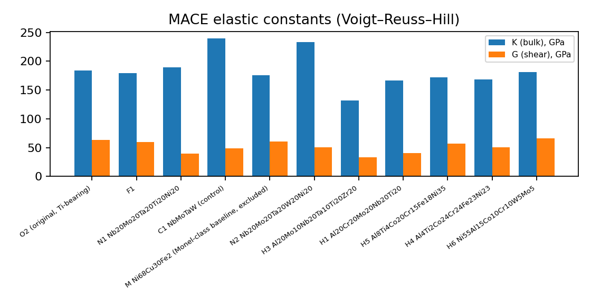
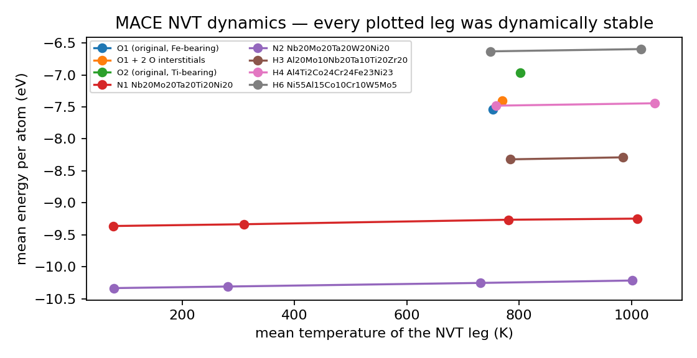

# Candidate materials for an SX500-class FFSC oxidizer-rich preburner

*Computational screening report, 2026-09-06. Prepared for review by materials scientists. Every quantitative statement is traceable to a computation recorded in Appendix A or to a cited source. Evidence classes used throughout: **execution** — computed in this work; **screening** — empirical descriptor, ranks candidates but does not qualify them; **literature** — published measurement or statement.*

## Summary

Fifteen alloy compositions were screened for the oxidizer-rich preburner of a full-flow staged-combustion engine (near-pure oxygen, 50–61 MPa, 460–873 K gas). Screening used empirical solid-solution descriptors, a machine-learned interatomic potential (MACE) for relaxation, elastic constants and finite-temperature dynamics, and harmonic phonons for one alloy. **No candidate has a density-functional-theory result**; the DFT runs completed to date are single- and two-atom path checks, and a 16-atom campaign on five candidates was still running when this report was written. **No oxidation, ignition, hydrogen-embrittlement, creep or fatigue property was computed** — those decide the application and require experiment.

A prior-art search over ten of the fifteen compositions found that **four of the high-entropy candidates are already published**, two with published high-temperature oxidation studies, and two more have close published neighbours. Four compositions were not found in the literature searched. These verdicts were not independently checked (the checking pass did not run) and the patent search was incomplete; both limits are stated in Section 5.

The recommendation (Section 7) is therefore split: build the four nickel-base compositions that were not found in the literature and are titanium-free or titanium-lean on the oxidizer side, and treat the published high-entropy alloys as benchmark materials whose existing oxidation data should be read before any of them is cast.

## 1. Candidates for fabrication

Compositions are atomic percent. "Prior art" is from Section 5 and is unverified.

| ID | Composition (at%) | Family | Target phases | Environment | Prior art | Rationale | First test |
|---|---|---|---|---|---|---|---|
| **O2-TF-Fe0** | Ni60Co12Cr12Al8W4Mo4 | Ni-base, γ/γ′ single crystal | FCC γ + γ′ (Ni3Al) | Oxidizer-rich (near-pure O2, 50–61 MPa, 460–873 K) | Not assessed | Primary blade alloy. Ti- and Fe-free: Ti alloys are NASA's ignition-sensitive class and steels rank more flammable than Ni alloys (NBS 1972; WSTF 1991). | Cast button; XRD/SEM; cyclic oxidation 700–900 K in O2; promoted-ignition screen (ASTM G124) |
| **O2-TF** | Ni54Co12Cr12Al8W4Mo4Fe6 | Ni-base, γ/γ′ | FCC γ + γ′ | Oxidizer-rich | Not found in searches | Same blade alloy keeping 6 at% Fe if strength or cost requires; second to O2-TF-Fe0 on oxygen grounds. | As O2-TF-Fe0 |
| **O1-Fe0** | Ni45Co20Cr15W10Mo5Al5 | Ni-base solid solution | FCC γ (+γ′) | Oxidizer-rich | Not found in searches | Conservative control; W and Mo for creep. | As above |
| **O3-Fe0** | Ni60Al15Co10Cr10W5 | Ni-base, alumina-former | FCC (+B2 NiAl) | Oxidizer-rich duct/liner | Close published | Alumina-forming gas-path alloy; confirm α-Al2O3 scale before promoting. | Cyclic oxidation, scale identification (XRD/EDS) |
| **O4-Fe0** | Ni50Al15Co20Cr15 | Ni-base dual phase | FCC + B2 | Oxidizer-rich liner/manifold | Close published | Cast- or wrought-capable; the cheapest of the set. | As above |
| **F1** | Ni40Fe20Co10Cr10Al8W5Mo4Ti3 | Ni–Fe base, γ/γ′ | FCC + γ′ | Fuel-rich (H2-rich, reducing) | Not found in searches | After the ONERA THYMONEL 8 precedent; aimed at low hydrogen sensitivity. Ω undefined (Ti–W pair missing from the mixing-enthalpy table). | Tensile + LCF in 34.5 MPa H2 (NASA CR-199837 protocol) |
| **F2** | Fe40Ni25Cr15Al12Mo4W4 | FeCrAl-type | BCC + FCC | Fuel-rich (CH4-rich) | Not found in searches | Chosen against coking on the methane side. | Coking exposure 850 K vs Inconel 718 coupon |
| **H1** | Al20Cr20Mo20Nb20Ti20 | Refractory HEA, Al+Cr | BCC (+ protective Al2O3/Cr2O3 scale intended) | Oxidizer-rich — candidate against the Monel K-500 oxygen bar and SX500 mechanical bar (R7) | Published | Al and Cr added to a refractory base to form a protective scale; refractory oxidation and MoO3 volatility are the risk the design answers. Standing against the bars: see 1.1. | Cyclic oxidation 700–1300 K; pesting check; promoted ignition |
| **H2** | Al13Cr7Mo19Nb18Ta26Ti17 | Refractory HEA, Ta-rich, Al+Cr | BCC | Oxidizer-rich (R7) | Published | Ta-rich variant of H1 with the highest melting estimate of the set (≈2505 K). Standing against the bars: see 1.1. | As H1 |
| **H3** | Al20Mo10Nb20Ta10Ti20Zr20 | Refractory HEA (Senkov AlMo0.5NbTa0.5TiZr family) | BCC | Oxidizer-rich (R7), control | Published | Literature RHEA control; stable in MD at 772 and 1000 K (below). | As H1 |
| **H4** | Al4Ti2Co24Cr24Fe23Ni23 | High-entropy superalloy | FCC + γ′ (Al/Ti) | Oxidizer-rich (R7) | Published | Near-equiatomic Co-Cr-Fe-Ni with Al+Ti for γ′. Carries 23 at% Fe and 2 at% Ti — both flagged for the oxygen side (R7 caveat). | Oxidation + promoted-ignition screen before any mechanical work |
| **H5** | Al8Ti4Co20Cr15Fe18Ni35 | High-entropy superalloy, Ni-rich | FCC + γ′ | Oxidizer-rich (R7) | Not assessed | Higher Ni and γ′ fraction than H4; 18 at% Fe, 4 at% Ti — same caveat. | As H4 |
| **H6** | Ni55Al15Co10Cr10W5Mo5 | Ni-rich HEA | FCC + γ′/B2 | Oxidizer-rich (R7) | Not assessed | Ti- and Fe-free Ni-rich HEA; highest moduli of the high-entropy set (below). | As O2-TF-Fe0 |
| **N1** | Nb20Mo20Ta20Ti20Ni20 | Ni-bearing refractory HEA | BCC | Screened; review §11: OUT for oxygen side (refractory oxidation, volatile MoO3); fuel side open | Not assessed | Dynamically stable 80–1000 K; zero imaginary phonon modes. | Oxidation test decides |
| **N2** | Nb20Mo20Ta20W20Ni20 | Ni-bearing refractory HEA | BCC | As N1 | Not assessed | Dynamically stable 80–1000 K. | As N1 |

### 1.1 Order of fabrication

1. **O2-TF-Fe0, O2-TF, O1-Fe0** — nickel-base γ/γ′ blade compositions, titanium-free, iron-free or iron-lean. O1-Fe0 and O2-TF were not found in the literature searched; O2-TF-Fe0 was not assessed. Cast first: they carry the least oxygen-compatibility risk of the set on the published metal-flammability ranking, and they are the compositions the programme would own.
2. **O3-Fe0, O4-Fe0** — alumina-forming duct and liner compositions. Close compositions are published (Section 5); read those first, then cast.
3. **F1, F2** — fuel-side compositions. Neither was found in the literature searched. They are gated by hydrogen and coking tests, not by oxygen.
4. **H1, H2** — published refractory high-entropy alloys with published oxidation studies. Do not cast to establish novelty; obtain and read the published oxidation data first, then decide whether a modified composition is warranted.
5. **H3, H4, H5, H6, N1, N2** — hold. H3 and H4 are published; H5, H6, N1 and N2 were not assessed for prior art, and N1/N2 are ruled out for the oxygen side on refractory-oxidation grounds in the underlying review.

### 1.2 Standing against the two performance bars

*Assessment written by the high-entropy screening run as its closing synthesis, quoted verbatim. Its labels map as A = H3, B = H1, B′ = H2, D1 = H4, D2 = H5, E = H6.*

**Against the Monel K-500 oxygen bar:** nothing computed here measures oxygen compatibility. Per the review's own §10.5/§11 record, Monel-class is the only class *measured* above ORPB pressure (>68.9 MPa, WSTF) and no ignition data exist above ~13.8 MPa for anything else. E (Ni-rich FCC, Al+Cr formers, small W/Mo fractions) is the closest *by analogy* to the Ni–Cu class; A/B/B′ inherit §11's ruling against bare Mo/Nb/Ta (MoO₃ volatilisation >923 K, interstitial-O embrittlement), and A additionally carries 20 at% Ti — per the review's own NASA ranking, titanium is the ignition-sensitive element, so A is *disqualified-looking on oxygen grounds* despite the best strength record. B′ has the only *measured* protective-scale response of the set, but in air at ambient pressure.

**Against the SX500 mechanical bar:** elastic constants are not yield strength. E's G/B 0.365 / G 66 GPa and D1's G 57 GPa are respectable FCC screening numbers; A has a real literature strength (964 MPa at 1273 K, arc-melted predecessor noted as "strength above 800 °C needs to be enhanced") that plausibly beats polycrystal Ni superalloys at that temperature, but single-crystal γ/γ′ creep capability is a different game and SX500's composition is unpublished. None of this substitutes for creep/LCF testing, and **nothing here substitutes for promoted-ignition testing at ~60 MPa** (ASTM G124-class screen on actual buttons).

**Missing before any of this is believable, per candidate:** A — cyclic oxidation 460–873 K in O2 + ignition screen (and a Ti-reduction variant); B/B′ — high-pO2 promotion test, B′ relax/elastic/MD completion; C — a Tier 0 table entry that can even be computed (Si radius gap) + MACE refuses Si ground states; D1/D2 — CALPHAD γ′ fractions (tier 2 unavailable: pycalphad not importable), √′ lattice-parameter mismatch, intermediate-temperature embrittlement check; E — everything: it is a design with screens, no literature existence.

## 2. Requirements and constraints

| Requirement | Statement | Source |
|---|---|---|
| **R1** — Hot-oxygen ignition & oxidation resistance (ORPB). | Near-pure O2 at 460–873 K, 50–61 MPa, with particle/friction ignition initiators a documented reality . Metals ranked by NASA/WSTF promoted-ignition data; Ag, Cu, bronze, and Monel are the ignition-resistant benchmarks; most structural superalloys will burn on | Review §3.3 |
| **R2** — Creep/fatigue strength at 600–900 K under 100–800 bar | (turbine blades, disks, hot gas ducts). Single-crystal Ni-base alloys are the proven solution . | Review §3.3 |
| **R3** — HEE resistance (FRPB, hydrogen engines). | Ductility/fatigue loss in high-pressure H2, worst near room temperature, quantified at **34.5 MPa H2** for SSME-class alloys . | Review §3.3 |
| **R4** — Coking/carbon-deposition tolerance (FRPB, methanolox/methane). | Ni-bearing surfaces are active methane-pyrolysis/carbon-formation catalysts in the catalysis literature ; engineering-alloy coking data at FFSC FRPB conditions is sparse (open question). | Review §3.3 |
| **R5** — Thermal-cycling (LCF/TMF) life. | Reusability targets: RD-170 designed for ≥20 flights (achieved 21 hot tests on one unit) ; SSME blade HCF/LCF failures under hydrogen + thermal fatigue are extensively documented . | Review §3.3 |
| **R6** — Manufacturability & inspectability. | High-gradient single-crystal casting + HIP + powder metallurgy are the enablers . | Review §3.3 |
| **R7** — Customer exclusion and target | Monel K-500 excluded by customer (ESA) statement — the oxygen-compatibility baseline to match, not a candidate; SX500-class single-crystal superalloy is the mechanical bar to beat. Relayed by the owner 2026-09-06. | Customer / NASA sources |
| **Ti/Fe** — Oxidizer-side exclusion | Titanium is in NASA's ignition-sensitive class and iron-base alloys rank more flammable than Ni-base in high-pressure oxygen (NBS survey NTRS 19740017534; WSTF NTRS 19920013202) — titanium out and iron minimised on the oxidizer side. | Customer / NASA sources |

## 3. Methods

**Empirical screening (Tier 0).** Yang's solid-solution parameter Ω = T_m·ΔS_mix/|ΔH_mix| (Ω ≥ 1.1 favours a disordered solid solution), atomic-size mismatch δ (≤ 6.6 % favours it), valence-electron concentration VEC (≥ 8.0 favours FCC, < 6.87 favours BCC, after Guo and Liu), melting point by rule of mixtures, and mixing enthalpy by the Miedema model. These rank compositions; they do not predict phase equilibria and cannot qualify a material. Class: screening.

**Machine-learned interatomic potential.** MACE foundation model (PBE-trained), 100-atom random substitutional cells on the target lattice. Relaxation to a force tolerance with cell degrees of freedom free; elastic constants by finite strain with Voigt–Reuss–Hill averaging, reported as bulk modulus K, shear modulus G, Young's modulus E, Poisson ratio ν, and the Pugh ratio G/K. Finite-temperature runs are NVT Langevin dynamics, 1 fs timestep, friction 0.01 fs⁻¹, 1000–2000 steps, with the cell judged dynamically stable if it retains its structure. A machine-learned potential trained on solid-state energies carries no combustion chemistry and cannot address ignition. Class: execution.

**Phonons.** Harmonic supercell force constants at the relaxed volume; imaginary modes indicate harmonic instability. Computed for N1 only, at one volume, so no quasi-harmonic thermal expansion could be derived (that needs at least three volumes). Class: execution.

**Density functional theory.** Quantum ESPRESSO 7.4.1 (pw.x), PseudoDojo norm-conserving scalar-relativistic v0.4 PBE standard pseudopotentials, plane-wave cutoffs taken from the set's own per-element hints (the largest hint over the species, normal accuracy), Marzari–Vanderbilt smearing 0.01 Ry, k-meshes from a 0.15 Å⁻¹ spacing. Section 4.5 states exactly which cells were run. Class: execution.

**Prior-art search.** Per composition, web search plus the Crossref, OpenAlex and Semantic Scholar APIs, with between 15 and 30 distinct queries per composition covering the element list in words, the common alloy-family names, and the exact formula. Limits in Section 5.

**Not used.** CALPHAD equilibrium and Scheil solidification (no thermodynamic database is installed); cluster expansion (the icet package was installed on 6 September but not run); classical molecular dynamics (no validated interatomic potential exists for these compositions).

## 4. Results

### 4.1 Empirical screen (class: screening)

| Candidate | Composition (at%) | Ω | δ (%) | VEC | T_m est. (K) | ΔH_mix (kJ/mol) |
|---|---|---|---|---|---|---|
| O2-TF-Fe0 | Ni60Co12Cr12Al8W4Mo4 | 2.16 | 4.83 | 8.52 | 1848.9 | -9.06 |
| O2-TF | Ni54Co12Cr12Al8W4Mo4Fe6 | 2.55 | 4.79 | 8.40 | 1853.9 | -8.88 |
| O1-Fe0 | Ni45Co20Cr15W10Mo5Al5 | 3.37 | 4.84 | 8.25 | 2019.2 | -7.45 |
| O3-Fe0 | Ni60Al15Co10Cr10W5 | 1.43 | 5.54 | 8.25 | 1756.4 | -12.31 |
| O4-Fe0 | Ni50Al15Co20Cr15 | 1.40 | 5.16 | 8.15 | 1684.6 | -12.36 |
| F1 | Ni40Fe20Co10Cr10Al8W5Mo4Ti3 | not computed | 5.37 | 8.00 | 1881.7 | not computed |
| F2 | Fe40Ni25Cr15Al12Mo4W4 | 2.71 | 5.00 | 7.44 | 1859.1 | -8.60 |
| H1 | Al20Cr20Mo20Nb20Ti20 | 1.81 | 4.90 | 4.80 | 2140.1 | -15.84 |
| H2 | Al13Cr7Mo19Nb18Ta26Ti17 | 2.83 | 3.52 | 4.83 | 2504.6 | -12.69 |
| H3 | Al20Mo10Nb20Ta10Ti20Zr20 | 1.53 | 4.45 | 4.30 | 2169.1 | -20.60 |
| H4 | Al4Ti2Co24Cr24Fe23Ni23 | 3.24 | 3.67 | 7.94 | 1837.6 | -7.38 |
| H5 | Al8Ti4Co20Cr15Fe18Ni35 | 2.08 | 4.98 | 8.04 | 1763.7 | -11.40 |
| H6 | Ni55Al15Co10Cr10W5Mo5 | 1.62 | 5.75 | 8.05 | 1814.8 | -12.80 |
| N1 | Nb20Mo20Ta20Ti20Ni20 | 2.05 | 6.19 | 6.00 | 2521.0 | -16.48 |
| N2 | Nb20Mo20Ta20W20Ni20 | 3.04 | 5.79 | 6.40 | 2871.8 | -12.64 |

F1's Ω is not computed because the Ti–W pair is absent from the Miedema mixing-enthalpy table used, so ΔH_mix is undefined for that composition; its other descriptors stand.

### 4.2 Relaxation and elastic constants (class: execution)

| Alloy | E per atom (eV) | K (GPa) | G (GPa) | E (GPa) | ν | G/K | Ductility (Pugh) |
|---|---|---|---|---|---|---|---|
| C1 NbMoTaW (control) | -11.5272 | 239.8 | 48.7 | 136.9 | 0.405 | 0.203 | ductile |
| F1 | -7.3589 | 179.0 | 59.3 | 160.1 | 0.351 | 0.331 | ductile |
| H1 Al20Cr20Mo20Nb20Ti20 | -8.4900 | 166.8 | 40.7 | 112.9 | 0.387 | 0.244 | ductile |
| H3 Al20Mo10Nb20Ta10Ti20Zr20 | -8.4242 | 132.1 | 33.2 | 91.9 | 0.384 | 0.251 | ductile |
| H4 Al4Ti2Co24Cr24Fe23Ni23 | -7.5771 | 168.3 | 51.0 | 139.0 | 0.362 | 0.303 | ductile |
| H5 Al8Ti4Co20Cr15Fe18Ni35 | -7.0752 | 171.8 | 57.3 | 154.8 | 0.350 | 0.334 | ductile |
| H6 Ni55Al15Co10Cr10W5Mo5 | -6.7276 | 181.1 | 66.0 | 176.7 | 0.337 | 0.365 | ductile |
| M Ni68Cu30Fe2 (Monel-class baseline, excluded) | -5.2888 | 175.6 | 61.0 | 164.0 | 0.344 | 0.347 | ductile |
| N1 Nb20Mo20Ta20Ti20Ni20 | -9.3723 | 189.3 | 39.5 | 110.7 | 0.403 | 0.208 | ductile |
| N2 Nb20Mo20Ta20W20Ni20 | -10.3428 | 233.2 | 50.2 | 140.5 | 0.400 | 0.215 | ductile |
| O2 (original, Ti-bearing) | -7.0685 | 184.3 | 63.2 | 170.2 | 0.346 | 0.343 | ductile |
| F2 | -7.6907 | not computed | not computed | not computed | not computed | not computed | not computed |
| H2 Al13Cr7Mo19Nb18Ta26Ti17 | -9.5511 | not computed | not computed | not computed | not computed | not computed | not computed |

All alloys with computed elastic constants are predicted ductile by the Pugh criterion (G/K < 0.57). Elastic constants are stiffness, not strength: they do not give yield stress, creep rate or fatigue life.

### 4.3 Dynamic stability against temperature (class: execution)

Each row is one NVT run. "Stable" means the cell retained its structure for the run.

| Alloy | Target T (K) | Mean T (K) | E per atom (eV) | σ(E) (eV) | Stable | Outcome |
|---|---|---|---|---|---|---|
| H1 Al20Cr20Mo20Nb20Ti20 | 772 | not computed | not computed | not computed | — | not completed (software defect in the job runner) |
| H1 Al20Cr20Mo20Nb20Ti20 | 1000 | not computed | not computed | not computed | — | not completed (software defect in the job runner) |
| H3 Al20Mo10Nb20Ta10Ti20Zr20 | 772 | 783.8 | -8.3201 | 0.0073 | yes | completed |
| H3 Al20Mo10Nb20Ta10Ti20Zr20 | 1000 | 985.2 | -8.2885 | 0.0092 | yes | completed |
| H4 Al4Ti2Co24Cr24Fe23Ni23 | 772 | 758.9 | -7.4808 | 0.0053 | yes | completed |
| H4 Al4Ti2Co24Cr24Fe23Ni23 | 1000 | 1041.7 | -7.4431 | 0.0121 | yes | completed |
| H5 Al8Ti4Co20Cr15Fe18Ni35 | 772 | not computed | not computed | not computed | — | not completed (software defect in the job runner) |
| H5 Al8Ti4Co20Cr15Fe18Ni35 | 1000 | not computed | not computed | not computed | — | not completed (software defect in the job runner) |
| H6 Ni55Al15Co10Cr10W5Mo5 | 772 | 749.0 | -6.6316 | 0.0077 | yes | completed |
| H6 Ni55Al15Co10Cr10W5Mo5 | 1000 | 1016.4 | -6.5961 | 0.0074 | yes | completed |
| N1 Nb20Mo20Ta20Ti20Ni20 | 80 | 77.5 | -9.3624 | 0.0004 | yes | completed |
| N1 Nb20Mo20Ta20Ti20Ni20 | 300 | 309.6 | -9.3347 | 0.0020 | yes | completed |
| N1 Nb20Mo20Ta20Ti20Ni20 | 772 | 780.5 | -9.2645 | 0.0049 | yes | completed |
| N1 Nb20Mo20Ta20Ti20Ni20 | 1000 | 1009.7 | -9.2469 | 0.0094 | yes | completed |
| N2 Nb20Mo20Ta20W20Ni20 | 80 | 77.9 | -10.3331 | 0.0008 | yes | completed |
| N2 Nb20Mo20Ta20W20Ni20 | 300 | 280.7 | -10.3086 | 0.0013 | yes | completed |
| N2 Nb20Mo20Ta20W20Ni20 | 772 | 730.9 | -10.2523 | 0.0064 | yes | completed |
| N2 Nb20Mo20Ta20W20Ni20 | 1000 | 1001.0 | -10.2148 | 0.0048 | yes | completed |
| O1 (original, Fe-bearing) | 772 | 752.9 | -7.5438 | 0.0059 | yes | completed |
| O1 + 2 O interstitials | 772 | 769.5 | -7.4033 | 0.0091 | yes | completed |
| O2 (original, Ti-bearing) | 772 | not computed | not computed | not computed | — | not completed (software defect in the job runner) |
| O2 (original, Ti-bearing) | 772 | 801.8 | -6.9671 | 0.0094 | yes | completed |

Every completed run was dynamically stable, including both nickel-bearing refractory alloys across the full 80–1000 K range and the nickel-base alloy with two interstitial oxygen atoms. Dynamic stability at temperature is a necessary condition, not evidence of oxidation or ignition behaviour.

### 4.4 Phonons (class: execution)

| Alloy | Imaginary modes | Harmonically stable | F_vib at 0 K (eV/atom) | F_vib at 1000 K (eV/atom) | Method quality |
|---|---|---|---|---|---|
| N1 Nb20Mo20Ta20Ti20Ni20 | 0 | yes | 0.026 | -0.436 | harmonic_supercell_identity_4q |

Thermal expansion was not derived: the quasi-harmonic method requires the free energy at three or more volumes and one volume was computed.

### 4.5 Density functional theory — status (class: execution)

No candidate alloy has a converged DFT result. The runs completed are path checks that confirm the DFT chain functions on the elements involved:

| Cell | Atoms | Calculation | Cutoff (Ry) | k-mesh | Total energy (Ry) | Purpose |
|---|---|---|---|---|---|---|
| fcc Ni | 1 atom | scf | 100 | 21×21×21 (286 irr.) | -335.5755 | path check |
| MoNb  | 2 atoms | scf | 68.0 | 14×14×14 | -265.1379 | path check |
| AlZr  | 2 atoms | scf | 60.0 | 13×13×13 | -105.9195 | path check |

A 16-atom campaign on five candidates (O2-TF-Fe0, H6, H4, H1, N1; random substitutional supercells, not special quasirandom structures) was started and had **not converged for any candidate** at the time of writing: 0 of 5 complete. These cells are 16 atoms with 5–6 elements at 98 Ry and 140 k-points, and each requires hours on 6 MPI ranks. Section 6 states what a credible DFT campaign requires.

An earlier configuration defect is relevant to any reader reproducing this work: a pinned cutoff of 60 Ry in the local settings file silently overrode the pseudopotential set's hints (nickel's hint is 98 Ry). It was found and corrected on 6 September, and the tool now reports which source the cutoff came from.

## 5. Novelty and prior art

Ten of the fifteen compositions were searched. **These verdicts are unverified**: the independent checking pass did not run, so each closest-match claim rests on a single search agent's reading. No systematic patent database (Espacenet, USPTO, WIPO, Lens) was queried for any composition; where Google Patents was reached it was through unstructured web queries.

| ID | Composition (at%) | Verdict | Closest published composition | Citation |
|---|---|---|---|---|
| O2-TF-Fe0 | Ni60Co12Cr12Al8W4Mo4 | not assessed (search not run) | — | — |
| O2-TF | Ni54Co12Cr12Al8W4Mo4Fe6 | **Not found in searches** | Nearest published family: same seven elements Ni-Co-Cr-Fe-Al-W-Mo as the base, but with Nb (2.5 at%) and, for x>0, Ti (up to 2.4 at%) added. Per-eleme | Design and thermomechanical properties of a γ' precipitate-strengthene, https://doi.org/10.1016/j.jallcom.2019.04.054 (open PDF: htt |
| O1-Fe0 | Ni45Co20Cr15W10Mo5Al5 | **Not found in searches** | Same 'high-entropy superalloy' label and same six elements present, and Ni/Co/Cr each within 2 at% of target. But W is 0.9 vs 10 at% (-9), Mo 1.2 vs 5 | High Temperature Oxidation Behavior of Ni-based High Entropy Superallo, https://doi.org/10.1016/j.corsci.2023.111683 |
| O3-Fe0 | Ni60Al15Co10Cr10W5 | **Close published** | Closest same-element-set (quinary Ni-Al-Co-Cr-W) Ni-rich alloy found. vs target: Ni +1.1, Cr +2.7, W -3.3 at% (inside 5 at%); Al -6.5, Co +6.0 at% (ou | Stress-induced formation of μ-TCP phase during the early-stage interdi, https://doi.org/10.1016/j.jallcom.2021.161980 (preprint: htt |
| O4-Fe0 | Ni50Al15Co20Cr15 | **Close published** | Same four-element set; every element within 5 at% of target (Ni +2.5, Al +2.5, Co 0, Cr +5). As-cast BCC(B2)/FCC lamellar eutectic, UTS 1272 MPa, 14.4 | Designing novel AlCoCrNi eutectic high entropy alloys, 10.1016/j.jallcom.2022.163775 |
| F1 | Ni40Fe20Co10Cr10Al8W5Mo4Ti3 | **Not found in searches** | Same element set as F1 plus Nb. Al, Ti, Cr, Mo, W within ~5 at% (W -4.1, Mo -2.8). Outside tolerance on Ni (+6.4), Co (+9.2) and especially Fe (-13.9) | High Temperature Oxidation Behavior of Ni-based High Entropy Superallo, https://doi.org/10.1016/j.corsci.2023.111683 |
| F2 | Fe40Ni25Cr15Al12Mo4W4 | **Not found in searches** | Nearest published neighbour. Fe (40) and Ni (25) match exactly, Mo within 1 at% (5 vs 4). Fails the 5 at% criterion on Cr (25 vs 15, +10) and Al (5 vs | Ultrahigh hardness with exceptional wear resistance of novel cost-effe, https://doi.org/10.1016/j.colsurfa.2024.135413 ; https://doi |
| H1 | Al20Cr20Mo20Nb20Ti20 | **Published** | EXACT match to H1: same five elements, 20 at% each. Verified from the Crossref record of the paper (title carries the composition). Also studied a Si- | High temperature oxidation behavior of an equimolar refractory metal-b, 10.1016/j.jallcom.2016.07.219 |
| H2 | Al13Cr7Mo19Nb18Ta26Ti17 | **Published** | Exact match, 0 at% deviation on all six elements. Paper existence, title, authors, venue and DOI verified in Crossref, OpenAlex and Semantic Scholar.  | High-throughput oxidation screening and down-selection of refractory h, https://doi.org/10.1016/j.ijrmhm.2026.107940 |
| H3 | Al20Mo10Nb20Ta10Ti20Zr20 | **Published** | Exact match. Al:Mo:Nb:Ta:Ti:Zr = 1:0.5:1:0.5:1:1 over 5 atoms is 20/10/20/10/20/20 at%. Cited as ref [19] 'previously reported two-phase AlMo0.5NbTa0. | Microstructure and Properties of Aluminum-Containing Refractory High-E, 10.1007/s11837-014-1066-0 |
| H4 | Al4Ti2Co24Cr24Fe23Ni23 | **Published** | Same six-element set; Al and Ti identical; Co, Cr, Fe, Ni each differ by 0.5 at% (23.5 vs 24/24/23/23). At integer at% resolution this is H4. Original | A precipitation-hardened high-entropy alloy with outstanding tensile p, 10.1016/j.actamat.2015.08.076 |
| H5 | Al8Ti4Co20Cr15Fe18Ni35 | not assessed (search not run) | — | — |
| H6 | Ni55Al15Co10Cr10W5Mo5 | not assessed (search not run) | — | — |
| N1 | Nb20Mo20Ta20Ti20Ni20 | not assessed (search not run) | — | — |
| N2 | Nb20Mo20Ta20W20Ni20 | not assessed (search not run) | — | — |

**The four published compositions matter to the plan.** H1 (equiatomic Al-Cr-Mo-Nb-Ti) and H2 (Al-Cr-Mo-Nb-Ta-Ti) both appear in published high-temperature *oxidation* studies — the property that decides the oxidizer side. H3 is Senkov's AlMo₀.₅NbTa₀.₅TiZr, characterised since 2014. H4 matches a precipitation-hardened high-entropy alloy with published tensile and high-temperature flow data. For these, published measurements should be obtained and read before any casting; they are benchmarks, not discoveries.

**The four not found in the searches** (O1-Fe0, O2-TF, F1, F2) each have a named nearest published neighbour, listed above, typically a nickel-base high-entropy superalloy sharing the element set. "Not found in the literature searched" is a statement about the search, not a novelty claim.

## 5b. Configurational thermodynamics — does the solid solution survive? (class: execution)

Cluster expansions fitted to MACE energies (76 structures each, 5-fold cross-validation) and canonical Monte Carlo at 773, 1000 and 1273 K. All ten fits pass a 15 meV/atom cross-validation gate. Warren-Cowley parameters are given as the largest absolute value over significant pairs; a value near zero means a random solid solution.

| alloy | lattice | CE cutoffs Å | structures fitted | CV error meV/atom | SRO at 773 K | SRO at 1000 K | SRO at 1273 K | verdict |
|---|---|---|---|---|---|---|---|---|
| O2-TF-Fe0 (Ni60Co12Cr12Al8W4Mo4) | FCC | 4.5 / 3.5 | 76 | 8.0 | very strong (max α=1.00) | very strong (0.99) | strong (0.92) | not a random SS at any T; Ni–Al order + W/Mo–Al/W–Mo avoidance; strengthens on cooling, no transition in-window |
| H6 (Ni55Al15Co10Cr10W5Mo5) | FCC | 4.5 / 3.5 | 76 | 8.8 | very strong (max α=1.88) | very strong (1.65) | very strong (1.35) | not a random SS at any T; strongest FCC SRO; Cr–Mo pairing = σ precursor |
| H4 (Al4Ti2Co24Cr24Fe23Ni23) | FCC | 4.5 / 3.5 | 76 | 6.3 | matrix ~random; Al–Ti +0.96, Ti–Ni −0.70, Ni–Al −0.56 | matrix ~random; Ti–Ni −0.45 | solute SRO only (Al–Ti +0.87) | matrix stays disordered at all 3 T; only dilute Al/Ti order with Ni (γ′/η precursors), growing below ~1000 K |
| H1 (Al20Cr20Mo20Nb20Ti20) | BCC | 5.0 / 4.0 | 76 | 6.4 | very strong (max α=1.20) | very strong (1.15) | very strong (1.07) | not a random SS at any T; Ti–Cr/Cr–Mo attraction, Al–Cr avoidance, B2-like Al–Ti order |
| N1 (Nb20Mo20Ta20Ti20Ni20) | BCC | 5.0 / 4.0 | 76 | 7.0 | very strong (max α=1.53) | very strong (1.33) | strong (1.19) | not a random SS at any T; Ni–Ti ordering, Ni–Mo avoidance |
| N2 (Nb20Mo20Ta20W20Ni20) | BCC | 5.0 / 4.0 | 76 | 7.1 | very strong (max α=1.86) | very strong (1.82) | very strong (1.61) | not a random SS at any T; Ni–Ta ordering, Nb–Ta / Ni–Mo near-total avoidance |
| O1-Fe0 (Ni45Co20Cr15W10Mo5Al5) | FCC | 4.5 / 3.5 | 76 | 9.5 | very strong (max α=1.04) | very strong (0.94) | strong (0.77) | not a random SS at any T; Ni–Al order + Al–Cr/Mo–Al/W–Mo avoidance |
| H3 (Al20Mo10Nb20Ta10Ti20Zr20) | BCC | 4.5 / 3.5 | 76 | 7.7 | very strong (max α=1.27) | very strong (1.18) | strong (0.89) | not a random SS at any T; Ti–Mo and Al–Zr ordering, Al–Mo avoidance |
| O3-Fe0 (Ni60Al15Co10Cr10W5) | FCC | 4.5 / 3.5 | 76 | 4.3 | very strong (max α=1.69) | very strong (1.24) | strong (0.99) | not a random SS at any T; W–Al near-total avoidance, Co–W ordering, Ni–Al order |
| H2 (Al13Cr7Mo19Nb18Ta26Ti17) | BCC | 4.5 / 3.5 | 76 | 8.5 | extreme (max α=2.30) | extreme (2.02) | extreme (1.64) | not a random SS at any T; strongest SRO in the set: B2 Al–Ti order + Mo–Ta/Ta–Cr sorting |

**The central result.** Nine of the ten candidates do **not** remain random solid solutions at any temperature between 773 and 1273 K. Only H4 (Al4Ti2Co24Cr24Fe23Ni23) keeps a disordered matrix, with ordering confined to its dilute aluminium and titanium. Every refractory high-entropy alloy tested (H1, H2, H3, N1, N2) orders strongly, H2 most extremely of all. For the nickel-base γ/γ′ compositions the ordering is partly by design — the nickel-aluminium ordering is the γ′ the alloy is meant to form — but the accompanying tungsten, molybdenum and chromium clustering is not, and is a topologically-close-packed-phase precursor. This is the discriminator the empirical descriptors could not provide.

## 6. Limitations and open items

**What would change these recommendations.**

- Published oxidation data for H1 and H2 could promote a refractory high-entropy alloy to the oxidizer side, or eliminate the family.
- A CALPHAD assessment could eliminate any candidate on σ- or μ-phase formation or on solidification cracking before a casting is attempted. No database is installed; this is the single most valuable missing computation.
- Verification of the prior-art verdicts could move a composition between the "not found" and "published" groups.

**The DFT campaign that is actually required.** Formation energies and elastic constants at the DFT level for these alloys need special quasirandom structures of at least 32–64 atoms per composition, cutoffs near 98 Ry set by the nickel and cobalt hints, dense k-meshes for metals, and spin polarisation for the iron- and cobalt-bearing compositions. On the present hardware (12 cores) that is on the order of days per composition; it belongs on a cluster. The 16-atom runs started here are a feasibility probe, not the campaign.

**What only experiment can decide.** Promoted-ignition threshold pressure in oxygen (ASTM G124), cyclic oxidation kinetics and scale identity, hydrogen embrittlement under 34.5 MPa hydrogen, coking in methane-rich gas, creep and low-cycle fatigue at temperature. No computation in this report substitutes for any of them, and the literature read reports no ignition data above 13.8 MPa for any alloy, against a preburner pressure of 50–61 MPa.

**Known defects in the tooling** that affected these results: four finite-temperature runs failed on a model-loading race in the job runner, and two more were unfinished at the time of writing; a pinned plane-wave cutoff silently overrode the pseudopotential hints until it was corrected. Both are recorded in the project's issue history.

## 7. Recommendations

1. **Cast O2-TF-Fe0, O2-TF and O1-Fe0 first.** They are titanium-free or titanium-lean nickel-base γ/γ′ compositions, they pass the empirical screen, two of the three were not found in the literature searched, and they carry the least oxygen-compatibility risk under the published metal-flammability ranking. Characterise by X-ray diffraction and electron microscopy, then differential scanning calorimetry against the melting estimates in Section 4.1.
2. **Read before casting the high-entropy candidates.** Obtain the published oxidation studies for H1 and H2 and the mechanical data for H3 and H4. If those data show a protective scale at preburner temperature, propose a modified composition; if not, close the refractory branch.
3. **Run cyclic oxidation and a promoted-ignition screen** on the first castings at 700–900 K in oxygen, ASTM G124 for ignition. This is the decisive test for the oxidizer side and no computation replaces it.
4. **Install a CALPHAD database and run equilibrium, Scheil and cracking-index calculations** on every composition before any blade-class investment.
5. **Move the DFT work to a cluster** with special quasirandom structures, or drop DFT from the screening loop and state that the machine-learned potential is the level of theory used.
6. **Do not treat any composition in this report as qualified.** The screening ranks candidates for experiment; it does not establish oxygen compatibility, strength or life.

## References

1. lpre.de (NPO Energomash compilation), "РД-170 (11Д521) и РД-171 (11Д520)" — GG 53.5 MPa / O/F 54.3 / outlet gas 190–600 °C; turbine inlet 772 K at 50.9 MPa; anti-ignition materials & coating practice; failure history 1990/2007/2009. https://lpre.de/energomash/RD-170/
2. Astronautix, "RD-170" — chamber 300 atm; ~400 °C oxygen-rich gas. http://www.astronautix.com/r/rd-170.html
3. Astronautix, "RD-0120" — single fuel-rich preburner at 527 °C driving the HP turbopump. http://www.astronautix.com/r/rd-0120.html
4. *System Analysis of a 35-tonf-Class FFSC Methane Engine and Investigation of Oxidizer-Rich Preburner Operating Conditions*, J. Inst. Sci. Tech. Info. (2026), doi:10.54726/jisti.40.1.3 — ORPB 700 K / 610 bar / O/F 63; FRPB 850 K / 570 bar / O/F 0.13.
5. Wikipedia, "SpaceX Raptor" — FFSC, chamber pressure ~300 bar; SX300→SX500; SX500 rated 12,000 psi hot O2. https://en.wikipedia.org/wiki/SpaceX_Raptor
6. NextBigFuture — SX500 developed by SpaceX to handle hot oxygen at ~800 atm (press). https://www.nextbigfuture.com/
7. Fabbaloo — SX300/SX500/SX600 nickel-rich Inconel-family single-crystal superalloys (press). https://www.fabbaloo.com/
8. Peters, Biondo, DeLuca, *Investigation of Advanced Processed Single-Crystal Turbine Blade Alloys*, NASA CR-199837 (1995) — PWA 1482/1484 tailored for H2 turbopumps; screening in 34.5 MPa H2; ~10× fatigue life vs PWA 1480. https://ntrs.nasa.gov/citations/19960017548
9. Wikipedia, "BE-4" — oxygen-rich staged combustion, LOX/CH4, Pc 140 bar, first flight 2024. https://en.wikipedia.org/wiki/BE-4
10. Wikipedia, "YF-100" — Chinese LOX/kerosene oxidizer-rich staged combustion. https://en.wikipedia.org/wiki/YF-100
11. Caron, Cornu, Khan, De Monicault, *Development of a Hydrogen Resistant Superalloy for Single Crystal Blade Application in Rocket Engine Turbopumps*, Superalloys 1996, 53–60, doi:10.7449/1996/superalloys_1996_53_60 — THYMONEL 8 (single-crystal Ni+Fe, low HEE + high fatigue, turbopump airfoils).
12. Engine History, "SSME Part 6: HPFTP Turbine Blade Failures" — directionally solidified MAR-M-246 blades. https://www.enginehistory.org/Rockets/SSME/SSME6.pdf
13. NASA Facts, *Integrated Powerhead Demonstrator* (Wikisource) — dual ox-rich + fuel-rich preburners (FFSC). https://en.wikisource.org/wiki/NASA_Facts/Integrated_Powerhead_Demonstrator
14. NASA NTRS 20040084662 — IPD: 250-klbf H2/O2 full-flow staged-combustion demonstrator. https://ntrs.nasa.gov/api/citations/20040084662/downloads/20040084662.pdf
15. Astronautix, "IPD" — Aerojet-designed and tested oxidizer preburner. http://www.astronautix.com/i/ipd.html
16. GlobalSpec, "Preburner Tested for AR1 Rocket Engine" — LOX/kerosene ORSC, 500 klbf. https://insights.globalspec.com/article/4992/
17. US Air Force (wpafb.af.mil), "Air Force Demonstrates Rocket Engine Preburner for Advanced Liquid Rocket Engines" — HCB preburner, "extreme oxygen environments that conventional metals cannot survive." https://www.wpafb.af.mil/News/Article-Display/Article/1996823/
18. Wikipedia, "LE-7" — LH2/LOX staged combustion (Japan). https://en.wikipedia.org/wiki/LE-7
19. Vanoverbeke & Claus, *SSME Fuelside Preburner Two-Dimensional Analysis*, NASA TM-87299 (1986). https://ntrs.nasa.gov/citations/19860014145
20. *Fatigue Failure of Space Shuttle Main Engine Turbine Blades* (NASA techdoc via Internet Archive). https://archive.org/stream/nasa_techdoc_20000004407/
21. US Patent 5,023,050 — Superalloy for high-temperature hydrogen service (SSME context). https://patents.google.com/patent/US5023050A/en
22. Bowen & Nagy, *The evaluation of single crystal superalloys for turbopump blades in gaseous hydrogen* (PWA 1480E). https://www.semanticscholar.org/paper/9259952fa81f7819e1bb24f2076a620e66ac2008
23. Fritzemeier & Schnittgrund, *The influence of advanced processing on PWA 1480*, NASA (1989). http://hdl.handle.net/2060/19910015004
24. Petrasek & Stephens, *Fiber reinforced superalloys for rocket engines*, NASA (1988) — SSME blade environment: temperature, hydrogen, HCF, thermal fatigue/shock. http://hdl.handle.net/2060/19890006619
25. Morea & Wu, *Advanced High Pressure O2/H2 Technology*, NASA (1985). https://ntrs.nasa.gov/citations/19850018551
26. *Role of Microstructure on Hydrogen Embrittlement of Nickel Base Superalloy Single Crystals* (1994), doi:10.1002/9781118803363.ch81
27. *Assessment of Hydrogen Embrittlement in High-Alloy Chromium-Nickel Steels and Alloys in Hydrogen at High Pressures and Temperatures*, Phys. Met. Metallogr. (2018), doi:10.1007/s11223-019-00035-2
28. *Promoted Ignition Behavior of Engineering Alloys in High-Pressure Oxygen*, ASTM STP, doi:10.1520/stp26741s
29. *Friction-Induced Ignition of Metals in High-Pressure Oxygen*, ASTM STP, doi:10.1520/stp26742s
30. *Promoted Ignition-Combustion Behavior of Engineering Alloys at Elevated Temperatures and Pressures in Oxygen Gas Mixtures* (2000), doi:10.1520/stp12491s; *…Cast and Wrought Engineering Alloys in Oxygen-Enriched Atmospheres* (2003), doi:10.1520/stp11587s; *Ignition of Metals and Alloys in Gaseous Oxygen by Frictional Heating* (1986), doi:10.1520/stp19308s
31. *Frictional Ignition of Metals in High Pressure Oxygen: A Critical Reassessment of NASA Test Data*, AIAA 2023-1489, doi:10.2514/6.2023-1489
32. *Oxide tribolayer breakdown on sliding metal contacts drives thermal ignition*, Tribology Int. (2024), doi:10.1016/j.triboint.2024.110484
33. *Frictional ignition of Ti40 fireproof titanium alloys for aero-engine in oxygen-containing media*, Trans. Nonferrous Met. Soc. China (2013), doi:10.1016/s1003-6326(13)62728-4
34. US Patent 6,007,645 — Advanced high-strength, highly oxidation-resistant single-crystal superalloy (low Cr). https://patents.google.com/patent/US6007645A/en
35. *Experiments on an Oxidizer-Rich Preburner for Staged Combustion Cycle Rocket Engines*, J. Propulsion & Power (2014), doi:10.2514/1.b35202 (abstract via ResearchGate: https://www.researchgate.net/publication/277674980)
36. *Oxidizer-Rich Staged Combustion Cycle Preburner and Main Chamber Injector Testing at Purdue University*, AIAA 2004-3524, doi:10.2514/6.2004-3524
37. *Oxidizer-Rich Preburner Technology for Oxygen/Hydrogen Full Flow Cycle Applications* (2004), doi:10.2514/5.9781600866760.0683.0701
38. *Test verification of LOX/RP-1 high-pressure fuel/oxidizer-rich preburner designs* (1982/1983), doi:10.2514/6.1982-1153; doi:10.2514/3.8588
39. *Oxidizer-rich staged combustion rocket engines use and development in Russia* (1995), doi:10.2514/6.1995-3607
40. *LOX/Methane Studies for Fuel Rich Preburner* (2003), doi:10.2514/6.2003-5063
41. KSPE: *Development of Design Code for Oxidizer-Rich Preburner… Using Cantera* (2022), doi:10.6108/kspe.2022.26.6.010; *Results of Cold Flow Test and Design of Injectors for Oxidizer-rich Preburner* (2018), doi:10.6108/kspe.2018.22.1.052; *Numerical Analysis on Cooling Characteristics of Oxidizer-Rich Preburner* (2013), doi:10.6108/kspe.2013.17.3.067
42. *Linear Acoustic Analysis of the Preburner of an Oxidizer-Rich Staged Combustion Engine*, JPP (2019), doi:10.2514/1.b37132 (+ open PDF at https://www.yang.gatech.edu/publications/Journal/JPP+(2019,+Lioi)+ORSC+preburner.pdf)
43. Filin & Mkrtchyan, *Little-known facts of turbopump unit creation history in liquid rocket engine*, Vestnik MAI (2021), doi:10.34759/vst-2021-2-63-72
44. Chinese-language industry sources on GH-series superalloys in rocket engines (non-peer-reviewed): https://zhuanlan.zhihu.com/p/536997770 ; http://www.bq-sam.com/page95?article_id=99 ; https://www.hangbogroup.com/article/fb3eb163.html
45. YF-100K (130-t pump-back-swing staged-combustion engine, Chinese wiki). https://sat.huijiwiki.com/wiki/YF-100K
46. *Enhanced Oxidation Resistance of Ultrafine-Grain Microstructure AlCoCrFeNi High Entropy Alloy*, ACS Omega (2022), doi:10.1021/acsomega.1c06014 — PMC9026100, ingested into the local knowledge graph this run (claims: 98 μm as-cast grain → ~1 μm refined layer, 300–650 μm depth).
47. *High oxidation resistance of AlCoCrFeNi HEA through severe shear deformation processing*, J. Alloys Compd. (2022), doi:10.1016/j.jallcom.2022.165385
48. *Effect of Ti Addition on the Microstructure and High-Temperature Oxidation Property of AlCoCrFeNi HEA*, Korean J. Met. Mater. (2020), doi:10.1007/s12540-020-00708-7
49. *High-Temperature Oxidation of CoCrFeMnNi- and AlCoCrFeNi-Based HEAs: A Critical Review* (2026), doi:10.1007/s11085-026-10454-7
50. *Y/Sc Co-Doping Enhances Cyclic Oxidation Resistance of AlCoCrFeNi HEA* (2026), doi:10.1007/s11085-026-10426-x
51. *Oxidation behavior of arc melted AlCoCrFeNi multi-component HEAs*, J. Alloys Compd. (2016), doi:10.1016/j.jallcom.2016.02.257
52. NOMAD/OPTIMADE federated record: HEA Ti6WCr20Co16Ni60Al5 (ρ ≈ 8750 kg/m³). https://nomad-lab.eu/prod/v1/gui/entry/id/h_HJopxvQ7uejJukYthhaQ/BXal9lJHZjtpABB78ZRB1XyL9hnA
53. *Improvement of Hydrogen-Resistant Gas Turbine Engine Blades (single-crystal manufacturing, ceramic molds)*, open access (2024), PMC11396716. https://pmc.ncbi.nlm.nih.gov/articles/PMC11396716/
54. Methane carbon-formation/coking on Ni catalysts — catalysis literature anchor, doi:10.1016/s0167-2991(01)80186-5 (Studies in Surface Science and Catalysis). Alloy-specific coking data remains an open question (OQ4).
55. Tier-0 descriptors and Tier-1 MACE results, Section 5; MACE-MH-1 `omat_pbe` head, seed 20260506, cache keys `205808ae031c11985893fa4e1be2a01bf3f4a6e233f28336bd81408d76861a13` (relax) and `6baadf640fad4c6b57e91033ca41b980490be278624c59f54c85d6355ad70d5d` (elastic). Machine tiers: 0–1 available; 2–3 not installed.
56. Reed, *The Superalloys: Fundamentals and Applications* (2006). (open PDF copy seen in this run's searches)
57. Segersäll, *On Thermomechanical Fatigue of Single-Crystal Superalloys*, Linköping PhD thesis (2014), doi:10.3384/diss.diva-111643
58. Perrut, Caron, Thomas, Couret, *High temperature materials for aerospace applications: Ni-based superalloys and γ-TiAl alloys*, C. R. Physique (2018), doi:10.1016/j.crhy.2018.10.002
59. Yang et al., *Influence of platform position on stray grain nucleation in Ni-based single-crystal blade clusters*, China Foundry (2021), doi:10.1007/s41230-021-1053-3
60. Wikipedia, "YF-215" — Chinese 200-ton-class FFSC methalox engine in development. https://en.wikipedia.org/wiki/YF-215
NTRS 19740017534 — A survey of compatibility of materials with high pressure oxygen service (NBS for MSFC; NTRS date 1972).
NTRS 19920013202 — Test methods for determining the suitability of metal alloys for use in oxygen-enriched environments (NASA WSTF, 1991).

Prior-art sources for Section 5 are cited in that table by DOI or URL.

## Appendix A — Computation record

Every number in this report traces to one of these records.

| Quantity | Alloys | Tool | Record | Class |
|---|---|---|---|---|
| Ω, δ, VEC, T_m, ΔH_mix | 23 compositions | hea_descriptors | PRISM provenance store, sessions 20260905_220957_a078f501, 20260905_223133_6392089c, 20260906_002859_c1e2e95d, 20260906_013528_ba7e29ee, 20260906_023503_1cb6c2ce | screening |
| Relaxed energy per atom | F2 | MACE relax | job 01M1SKCNA2W76F7YWG7H1YJCPY | execution |
| Relaxed energy per atom | O2 (original, Ti-bearing) | MACE relax | job 01M1SKF5Q7RSRABN2SNA3SC794 | execution |
| Relaxed energy per atom | F1 | MACE relax | job 01M1SKF5QAGFXEPCVRWPNKWCE3 | execution |
| Relaxed energy per atom | N1 Nb20Mo20Ta20Ti20Ni20 | MACE relax | job 01M1SVCH9F8TT049569VY4E8Q7 | execution |
| Relaxed energy per atom | N2 Nb20Mo20Ta20W20Ni20 | MACE relax | job 01M1SVCH9M7XK5RHBRQ7FSP4EF | execution |
| Relaxed energy per atom | C1 NbMoTaW (control) | MACE relax | job 01M1SVCH9Q6MGDQA65B6DN5T37 | execution |
| Relaxed energy per atom | M Ni68Cu30Fe2 (Monel-class baseline, excluded) | MACE relax | job 01M1SVCH9XSQTSPEPQREPJXWK5 | execution |
| Relaxed energy per atom | H3 Al20Mo10Nb20Ta10Ti20Zr20 | MACE relax | job 01M1T2RM3C64TJ1WE0WK3TKH53 | execution |
| Relaxed energy per atom | H1 Al20Cr20Mo20Nb20Ti20 | MACE relax | job 01M1T2RM3HGA1NGMMASE6FGKQ9 | execution |
| Relaxed energy per atom | H5 Al8Ti4Co20Cr15Fe18Ni35 | MACE relax | job 01M1T2RM3NXDRNW8RQ3TYK6V7T | execution |
| Relaxed energy per atom | H4 Al4Ti2Co24Cr24Fe23Ni23 | MACE relax | job 01M1T2RM3R17EPBYMBQ6G9H9TA | execution |
| Relaxed energy per atom | H6 Ni55Al15Co10Cr10W5Mo5 | MACE relax | job 01M1T2RM3XDTD00DKK3ZSHRJDV | execution |
| Relaxed energy per atom | H2 Al13Cr7Mo19Nb18Ta26Ti17 | MACE relax | job 01M1T2YDB2BM0CT1847YNZGDP9 | execution |
| Elastic constants | O2 (original, Ti-bearing) | MACE elastic | job 01M1SKD12DMSR4634KFAZFFZV1 | execution |
| Elastic constants | F1 | MACE elastic | job 01M1SKD12FKG54WAED513F9KH0 | execution |
| Elastic constants | N1 Nb20Mo20Ta20Ti20Ni20 | MACE elastic | job 01M1SWWYZGFZC59MMMSSP1BXJK | execution |
| Elastic constants | C1 NbMoTaW (control) | MACE elastic | job 01M1SWWZ05N77981MW0WGZ5G9S | execution |
| Elastic constants | M Ni68Cu30Fe2 (Monel-class baseline, excluded) | MACE elastic | job 01M1SWWZ0BP9E15SVV5TV48WM5 | execution |
| Elastic constants | N2 Nb20Mo20Ta20W20Ni20 | MACE elastic | job 01M1SZ2D9Y01RAM03W5W4VEP0Z | execution |
| Elastic constants | H3 Al20Mo10Nb20Ta10Ti20Zr20 | MACE elastic | job 01M1T2YD6BJKFSPGYP533EY65Y | execution |
| Elastic constants | H1 Al20Cr20Mo20Nb20Ti20 | MACE elastic | job 01M1T2YD6J46CDRZHXD8BA22N8 | execution |
| Elastic constants | H5 Al8Ti4Co20Cr15Fe18Ni35 | MACE elastic | job 01M1T2YD88K60938YE6Q06YDKK | execution |
| Elastic constants | H4 Al4Ti2Co24Cr24Fe23Ni23 | MACE elastic | job 01M1T2YD95KBQAH1M1RV6SW0WE | execution |
| Elastic constants | H6 Ni55Al15Co10Cr10W5Mo5 | MACE elastic | job 01M1T2YD9ZN98SAGDJB2VDPYES | execution |
| NVT dynamics at 772 K | O1 (original, Fe-bearing) | MACE MD | job 01M1SQRV25YDZ2MYFCNCP0RXFH | execution |
| NVT dynamics at 772 K | O1 + 2 O interstitials | MACE MD | job 01M1SQRV2DQWP55JE209REBB22 | execution |
| NVT dynamics at 772 K | O2 (original, Ti-bearing) | MACE MD | job 01M1SQVGPRJ2N7CKKRD8QCGQVJ | execution |
| NVT dynamics at 80 K | N1 Nb20Mo20Ta20Ti20Ni20 | MACE MD | job 01M1SWZ7DZ51P9PPDSW334YCY1 | execution |
| NVT dynamics at 300 K | N1 Nb20Mo20Ta20Ti20Ni20 | MACE MD | job 01M1SWZ7E5FAQR0MZSCDVW15SN | execution |
| NVT dynamics at 772 K | N1 Nb20Mo20Ta20Ti20Ni20 | MACE MD | job 01M1SWZ7ECFPDPTPBGKGMDJS1G | execution |
| NVT dynamics at 1000 K | N1 Nb20Mo20Ta20Ti20Ni20 | MACE MD | job 01M1SWZ7EFTY43EC3YX2Q0B5BN | execution |
| NVT dynamics at 80 K | N2 Nb20Mo20Ta20W20Ni20 | MACE MD | job 01M1SWZ7EJNGHMMRZ415MZ8V4D | execution |
| NVT dynamics at 300 K | N2 Nb20Mo20Ta20W20Ni20 | MACE MD | job 01M1SWZ7EPX5FRMEH4R08Z523K | execution |
| NVT dynamics at 772 K | N2 Nb20Mo20Ta20W20Ni20 | MACE MD | job 01M1SWZ7ERMHE63EVS4RJG0YMP | execution |
| NVT dynamics at 1000 K | N2 Nb20Mo20Ta20W20Ni20 | MACE MD | job 01M1SWZ7ETNK5WSZTSBNRKZ55T | execution |
| NVT dynamics at 772 K | H3 Al20Mo10Nb20Ta10Ti20Zr20 | MACE MD | job 01M1T2YDA2AEX11HERGJFF105Z | execution |
| NVT dynamics at 1000 K | H3 Al20Mo10Nb20Ta10Ti20Zr20 | MACE MD | job 01M1T2YDA690VTVFWDXN96X2G4 | execution |
| NVT dynamics at 772 K | H4 Al4Ti2Co24Cr24Fe23Ni23 | MACE MD | job 01M1T2YDAKDK6FCBG33VQR3V70 | execution |
| NVT dynamics at 1000 K | H4 Al4Ti2Co24Cr24Fe23Ni23 | MACE MD | job 01M1T2YDARGERHB2X4AF904H57 | execution |
| NVT dynamics at 772 K | H6 Ni55Al15Co10Cr10W5Mo5 | MACE MD | job 01M1T2YDAV3GV9N0GC9VRF2K56 | execution |
| NVT dynamics at 1000 K | H6 Ni55Al15Co10Cr10W5Mo5 | MACE MD | job 01M1T2YDAY107QHMNPKH72GFM0 | execution |
| Harmonic phonons | N1 Nb20Mo20Ta20Ti20Ni20 | MACE phonons | job 01M1SX7XX820HBBCA826HAKRVW | execution |
| DFT total energy | fcc Ni | Quantum ESPRESSO pw.x | maintainer rerun after tool fix (not an agent computation) | execution |
| DFT total energy | MoNb  | Quantum ESPRESSO pw.x | agent, run 10 | execution |
| DFT total energy | AlZr  | Quantum ESPRESSO pw.x | agent, run 11 | execution |
| Prior-art verdicts | 10 compositions | web + Crossref/OpenAlex/Semantic Scholar | workflow wf_014b7d27, unverified | literature |

The full research narrative and the citation-verification appendix are in the archival document `SX500_FFSC_preburner_materials_review.md`.
